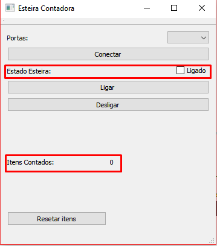

# Esteira Contadora

## Material Usado

* 1 Arduino Uno
* 1 Relé 5
* 1 LDR
* 1 LED 
* 1 Resistor 10K ohms
* 1 Resistor 330 ohms
* 1 Motor DC
* 2 Pilhas 3,8V
* Jumpers
* Esteira Caseira (Construção: Anderson Martiniano)

## Objetivo

Esteira contadora de itens automatizada, por meio de um feixe de luz de um LED em conjunto com um LDR.

## Tela inicial do programa

Tela de operações e informações do programa, todas as ações são executadas aqui:

## Área de conexão

Na caixa de seleção, defina a porta onde se encontra a esteira que deseja controlar, em seguida clique em "conectar".

## Funcionalidades do Programa

Aqui as funcionalidades do programa:

* "Ligar" irá ativar a esteira.
* "Desligar irá desativar a esteira.
* "Resetar itens" ira recomeçar contagem do 0.

> Obs.: A velocidade da esteira é definida de acordo com a tensão de entrada, no prototipo foi usado 2 pilhas de 3,8V.

## Informações do estado atual da esteira

Informações principais da esteira:

* Itens Contados: Indica o número de objetos contados desde o último reset.
* Estado Esteira: se o box estiver marcado siginifica q a esteira está ligada.
> Obs.: Marcar o box não ira ligar a esteira.

## Informações também disponiveis na Web

Assim como na aplicação Desktop, as informações e funcionalidades se encontram disponiveis na internet.

Acessar http://esteira-contadora.herokuapp.com

